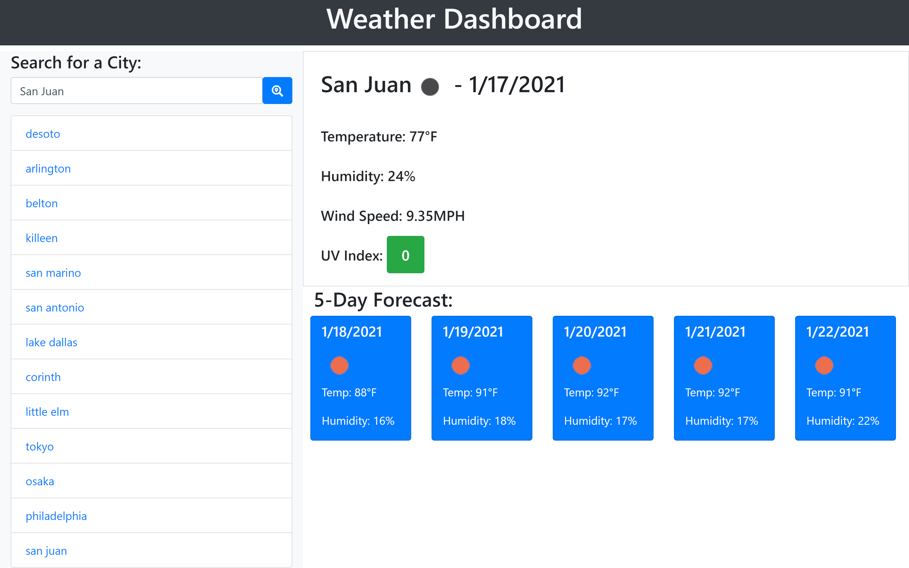

# weather-dashboard
## General Info

*  Created a Weather Dashboard using HTML, JS, Bootstrap, and the Open-Weather web based API

*  User can input city in search bar and come up with the current weather, as well as a 5 day forecast

*  previous searches are saved in local storage and displayed on the page

*  When user clicks on a previous search, the current weather/5 day forecast are brought back on the page

*  Link to Deployed Site: (https://jnunez1229.github.io/weather-dashboard/)
 
### Screenshot

---